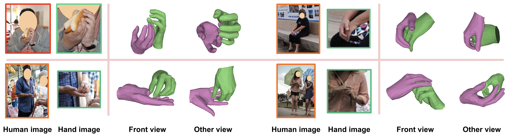
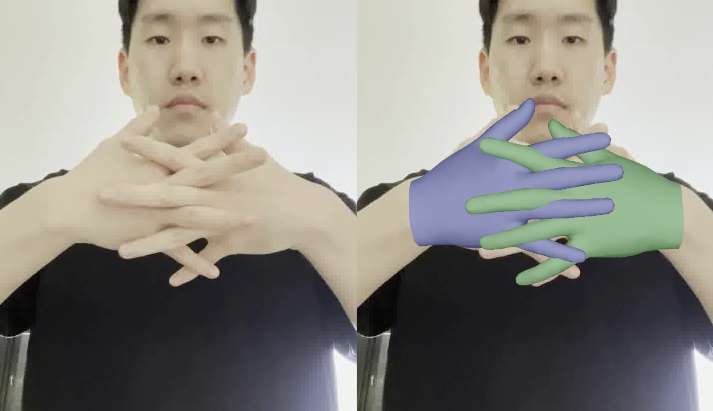
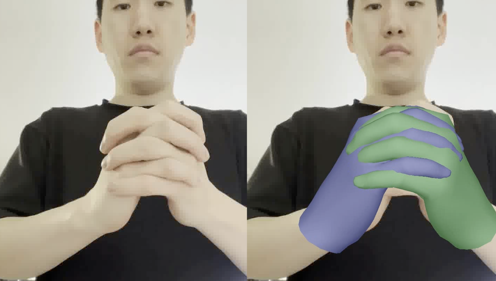
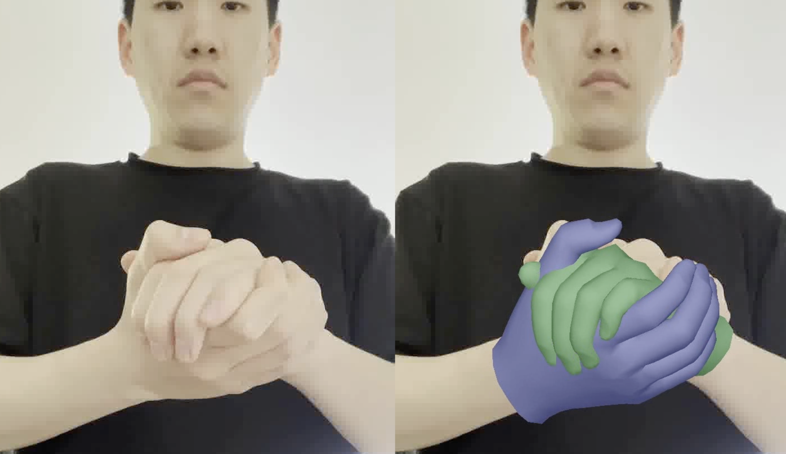
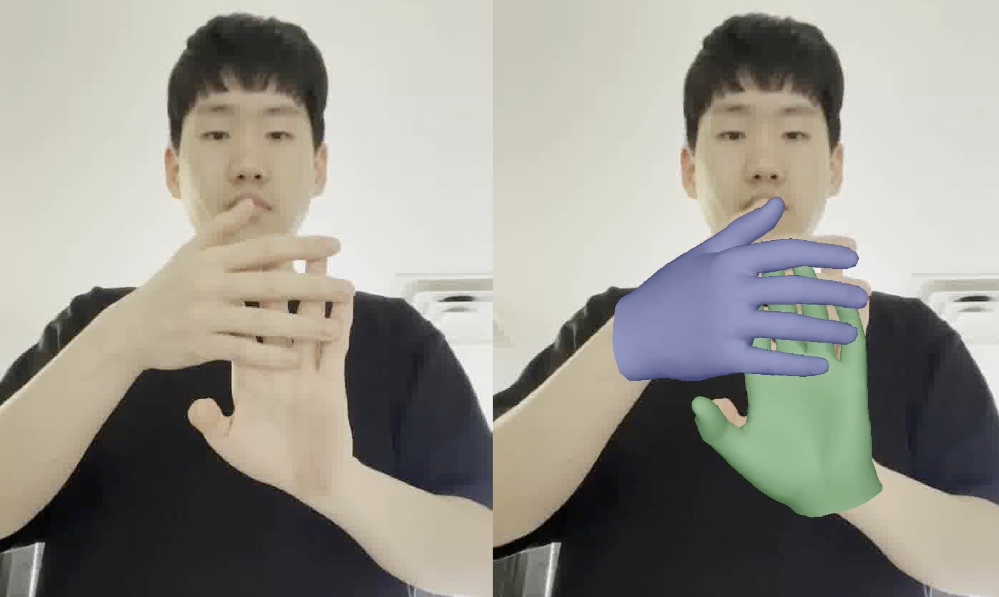
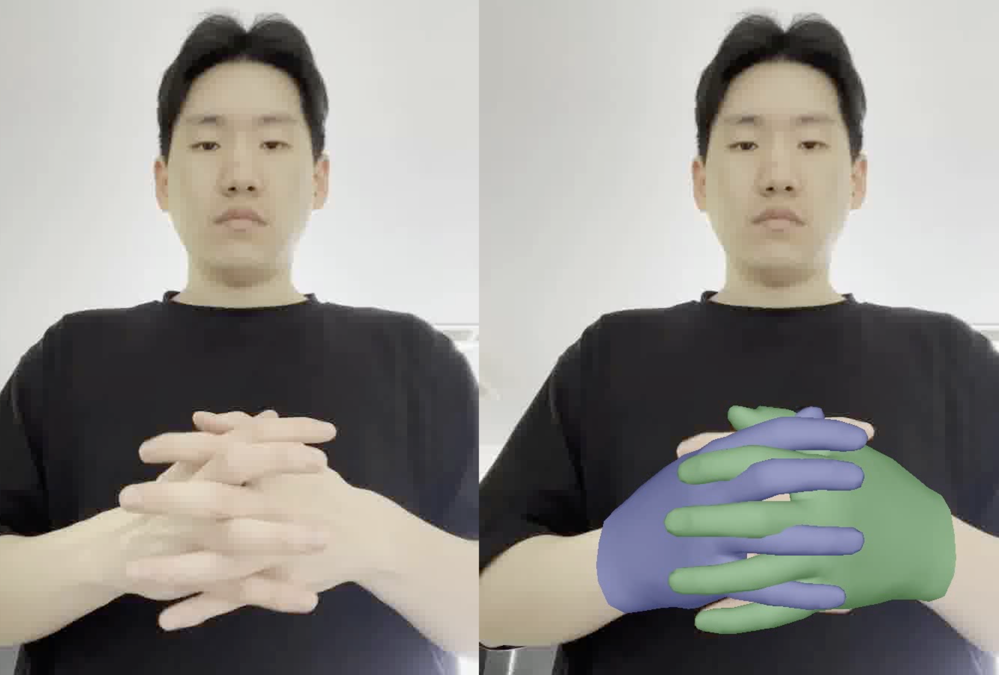
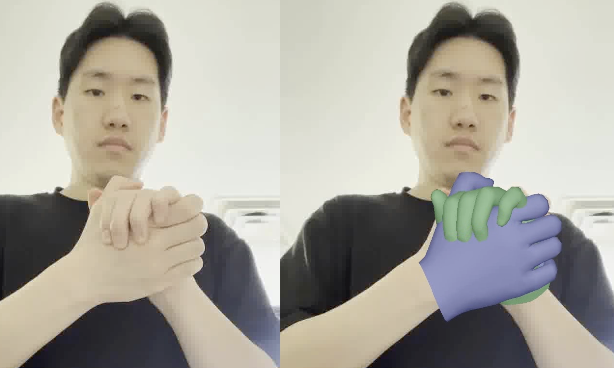

# Bringing Inputs to Shared Domains for 3D Interacting Hands Recovery in the Wild

## Our new Re:InterHand dataset has been released, which has much more diverse image appearances with more stable 3D GT. Check it out at [here](https://mks0601.github.io/ReInterHand)!

## Introduction
This repo is official **[PyTorch](https://pytorch.org)** implementation of **[Bringing Inputs to Shared Domains for 3D Interacting Hands Recovery in the Wild (CVPR 2023)](https://arxiv.org/abs/2303.13652)**. 

<p align="middle">

</p>

<p align="middle">

</p>

## Demo
1. Prepare `human_model_files` folder following below `Directory` part and place it at `common/utils/human_model_files`.
2. Move to `demo` folder.
3. Download pre-trained InterWild from [here](https://drive.google.com/file/d/1zZy3L6zrHJtWMUEJFonqDtRG9XGHabN1/view).
4. Put input images at `images`. **The image should be a cropped image, which contain a single human. For example, using a human detector. We have a hand detection network, so no worry about the hand postiions!**
5. Run `python demo.py --gpu $GPU_ID`
6. Boxes, meshes, MANO parameters, and renderings are saved at `boxes`, `meshes`, `params`, and `renders`, respectively.

## Directory

### Root
The `${ROOT}` is described as below.
```
${ROOT}
|-- data
|-- demo
|-- common
|-- main
|-- output
```
* `data` contains data loading codes and soft links to images and annotations directories.
* `demo` contains the demo code
* `common` contains kernel code. You should put `MANO_RIGHT.pkl` and `MANO_LEFT.pkl` at `common/utils/human_model_files/mano`, where those are available in [here](https://mano.is.tue.mpg.de/).
* `main` contains high-level codes for training or testing the network.
* `output` contains log, trained models, visualized outputs, and test result.

### Data
You need to follow directory structure of the `data` as below.
```
${ROOT}
|-- data
|   |-- InterHand26M
|   |   |-- annotations
|   |   |   |-- train
|   |   |   |-- test
|   |   |-- images
|   |-- MSCOCO
|   |   |-- annotations
|   |   |   |-- coco_wholebody_train_v1.0.json
|   |   |   |-- coco_wholebody_val_v1.0.json
|   |   |   |-- MSCOCO_train_MANO_NeuralAnnot.json
|   |   |-- images
|   |   |   |-- train2017
|   |   |   |-- val2017
|   |-- HIC
|   |   |-- data
|   |   |   |-- HIC.json
|   |-- ReInterHand
|   |   |-- data
|   |   |   |-- m--*
```
* Download InterHand2.6M [[HOMEPAGE](https://mks0601.github.io/InterHand2.6M/)]. `images` contains images in 5 fps, and `annotations` contains the `H+M` subset.
* Download the whole-body version of MSCOCO [[HOMEPAGE](https://github.com/jin-s13/COCO-WholeBody/)]. `MSCOCO_train_MANO_NeuralAnnot.json` can be downloaded from [[here](https://drive.google.com/file/d/1OuWlMor5f0TZLVSsojz5Mh6Ut93WkcJc/view)].
* Download HIC [[HOMEPAGE](https://files.is.tue.mpg.de/dtzionas/Hand-Object-Capture/)] [[annotations](https://drive.google.com/file/d/1oqquzJ7DY728M8zQoCYvvuZEBh8L8zkQ/view?usp=share_link)]. You need to download 1) all `Hand-Hand Interaction` sequences (`01.zip`-`14.zip`) and 2) some of `Hand-Object Interaction` seuqneces (`15.zip`-`21.zip`) and 3) MANO fits. Or you can simply run `python download.py` in the `data/HIC` folder.
* Download ReInterHand[[HOMEPAGE](https://mks0601.github.io/ReInterHand/)] at `data/ReInterHand/data`.

### Output
You need to follow the directory structure of the `output` folder as below.
```
${ROOT}
|-- output
|   |-- log
|   |-- model_dump
|   |-- result
|   |-- vis
```
* `log` folder contains training log file.
* `model_dump` folder contains saved checkpoints for each epoch.
* `result` folder contains final estimation files generated in the testing stage.
* `vis` folder contains visualized results.

## Running InterWild
### Start
* Prepare `human_model_files` folder following above `Directory` part and place it at `common/utils/human_model_files`.

### Train
In the `main` folder, run
```bash
python train.py --gpu 0-3
```
to train the network on the GPU 0,1,2,3. `--gpu 0,1,2,3` can be used instead of `--gpu 0-3`. If you want to continue experiment, run use `--continue`. 


### Test
* Checkpoint trained on [IH26M (H+M) + MSCOCO](https://drive.google.com/file/d/12temUVaIhrpUqw-zzXArqI6cm5aMfVWa/view?usp=share_link). FYI, all experimental results of the paper is from a checkpoint trained on IH26M (H) + MSCOCO.
* Checkpoint trained on [IH26M (H+M) + MSCOCO + ReInterHand (Mugsy_cameras)](https://drive.google.com/file/d/1zZy3L6zrHJtWMUEJFonqDtRG9XGHabN1/view?usp=sharing). 
* Checkpoint trained on [IH26M (H+M) + MSCOCO + ReInterHand (Ego_cameras)](https://drive.google.com/file/d/10ufTH3J95ss95p4eP7kIUweDCv0C320E/view?usp=sharing).
* Place the checkpoint at `output/model_dump'.
* Or if you want to test with our own trained model, place your model at `output/model_dump`.
* For the evaluation on InterHand2.6M dataset, we evaluated all methods in the paper on `human_annot` subset of interHand2.6M using `data/InterHand26M/aid_human_annot_test.txt`.

In the `main` folder, run 
```bash
python test.py --gpu 0-3 --test_epoch 6
```
to test the network on the GPU 0,1,2,3 with `snapshot_6.pth`.  `--gpu 0,1,2,3` can be used instead of `--gpu 0-3`. 


## Reference  
```  
@inproceedings{moon2023interwild,  
author = {Moon, Gyeongsik},  
title = {Bringing Inputs to Shared Domains for {3D} Interacting Hands Recovery in the Wild},  
booktitle = {CVPR},  
year = {2023}  
} 

@inproceedings{moon2023reinterhand,
  title     = {A Dataset of Relighted {3D} Interacting Hands},
  author    = {Moon, Gyeongsik and Saito, Shunsuke and Xu, Weipeng and Joshi, Rohan and Buffalini, Julia and Bellan, Harley and Rosen, Nicholas and Richardson, Jesse and Mize Mallorie and Bree, Philippe and Simon, Tomas and Peng, Bo and Garg, Shubham and McPhail, Kevyn and Shiratori, Takaaki},
  booktitle = {NeurIPS Track on Datasets and Benchmarks},
  year      = {2023},
}
```

## License
This repo is CC-BY-NC 4.0 licensed, as found in the LICENSE file.

[[Terms of Use](https://opensource.facebook.com/legal/terms)]
[[Privacy Policy](https://opensource.facebook.com/legal/privacy)]

